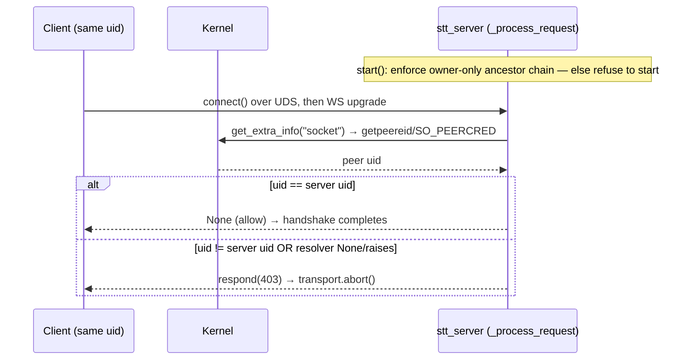

# Feature: UDS server-side trust-boundary hardening

**Status:** Implemented (2026-06-26) on `feature/uds-trust-boundary-hardening` (phases 1–5) — pending Koda checkout coordination + merge
**Component:** Server Transport
**Assignee:** unassigned
**Priority:** High (security; trust boundary)
**Branch:** `feature/uds-trust-boundary-hardening`
**Created:** 2026-06-26
**Objective:** Close the two remaining same-host UDS trust-boundary gaps in
`stt_server` entirely on the server side — (1) make the socket un-plantable by
enforcing an owner-only, owner-owned socket directory chain before bind, and (2)
authenticate the connecting client by kernel-supplied peer credentials so a
foreign local uid cannot connect even if it reaches the socket.

---

## Context

A sibling client-side change added an inode/permission check that defends the
*client* against a spoofed server. That check is inherently TOCTOU: the client
can narrow the plant/swap window by re-checking on every connect but cannot
eliminate it. The server is better positioned to close the vector for both
sides. Three server-side measures were proposed; one is already shipped:

| # | Measure | State |
|---|---|---|
| 1 | Un-plantable socket: owner-owned, non-writable ancestor chain through the trusted root, refuse to start otherwise | **Missing** — this plan |
| 2 | `umask`-at-bind so the socket inode is `0600` from birth | **Already done** — `server.py:152` wraps `ws_unix_serve` in `os.umask(0o077)` + `finally` restore, then `chmod 0o600` at `server.py:162-166`. Out of scope. |
| 3 | Peer-credential auth: reject any peer whose `uid != server uid` | **Missing** — this plan |

Why #1 is highest-leverage: the `0600` mode on the socket *inode* stops a
foreign uid from `connect()`-ing, but does **not** stop the plant/swap attack.
An attacker with write on the parent directory `unlink()`s our inode and
`bind()`s their own; the client then connects to the attacker's socket. The
only defense is denying others write on the path that can replace the socket —
i.e. every ancestor from the socket's bind directory through the trusted root is
owner-owned and not group/other-writable (sticky-bit directories excepted),
verified at startup. On stock macOS `~/Library/Caches` is `0700`, but the
`pipecat-stt/` subdir we `mkdir` inherits the process umask
(commonly `0755`), and a custom `STT_WS_SOCKET` pointing at a world-writable
location defeats everything. Enforcing at startup makes it robust regardless of
where the path points.

Why #3 is **defense-in-depth, not the primary boundary** for the same-host case:
once #1 enforces the owner-only ancestor chain, a foreign uid already cannot even
*traverse* to the socket (no `+x` on the relevant directory → `connect()` fails
`EACCES` at path resolution, before the socket mode or any handshake). So #1 alone closes
the same-host foreign-uid vector at the filesystem layer. #3 still earns its
place because the uid it checks is **kernel-supplied and unforgeable**, so it
holds even when the filesystem perms are looser than intended (a misconfigured
dir, a relaxed socket mode, a future abstract/Linux socket, or simply not
trusting file modes as the sole boundary). It is the kernel-authoritative backstop
behind the filesystem boundary — not a strictly-stronger replacement for it.
Corollary on the token: for UDS the bearer token is redundant (the file-perm
boundary + peer-cred both dominate it); we keep it for TCP/remote, which has
neither a file-permission boundary nor peer creds. **This reframing matters for
testing #3 in isolation — see Phase 4.**

### Scope: server-side only, no client changes

Both measures are **server-side only and require no client code change**:

- #1 only touches the directory the server binds into; the client never sees it.
- #3 reads the peer uid from the **kernel** (`SO_PEERCRED` / `getpeereid`), not
  from anything the client sends. A legitimate same-uid client passes the check
  having done nothing — no new handshake field, no token, no library bump.

**Precondition (deployment fact, not code):** peer-cred auth assumes the client
and server always run as the **same uid**. The Koda cross-repo contract runs
both as per-user LaunchAgents (same uid), so this holds today. If a future
deployment runs the server as a daemon user and the client as the logged-in
user, #3 would correctly reject it and that deployment would need coordination —
still not a client code change. This precondition is written into Requirements.

---

## Requirements

1. **R1 — Socket-dir ancestor enforcement (blocking, fatal).** Before bind, the
   server MUST walk every directory component from the socket's bind directory
   up to and including the trusted root directory. Every component in that walk
   MUST be owned by the running uid (`st_uid == os.geteuid()`) and MUST NOT be
   group-writable or other-writable (`st_mode & 0o022 == 0`), except sticky-bit
   directories. If the server creates missing socket directories, it MUST create
   them `0700` and then re-`stat` the full walk. If any component fails either
   check, the server MUST refuse to start with an actionable error naming the
   path and offending condition. It MUST NOT silently `chmod`/`chown` a
   pre-existing directory it does not own.
2. **R2 — Peer-cred auth (UDS only).** On the UDS transport, the server MUST
   reject any connection whose peer uid `!= os.geteuid()` before the WebSocket
   handshake completes, returning a `403`. TCP connections are unaffected (no
   peer-cred concept) and continue to use Origin + optional bearer-token checks.
3. **R3 — Cross-platform.** Peer-cred resolution MUST work on macOS (primary)
   and Linux. macOS has no `socket.SO_PEERCRED`; use `getpeereid(2)` via
   `ctypes` (or `LOCAL_PEERCRED`). Linux uses `socket.SO_PEERCRED`. A platform
   where neither is available MUST fail closed (reject) with a logged warning,
   not silently allow.
4. **R4 — Same-uid precondition.** The same-uid deployment assumption is
   documented in code comments and the security docs; behavior under uid
   mismatch is "reject," not "warn-and-allow."
5. **R5 — Bearer token unchanged for TCP.** #3 does not remove or weaken the
   existing bearer-token path; the token remains the TCP trust mechanism. The
   UDS-token-is-now-redundant observation is documented but the token plumbing
   is NOT ripped out in this change (keeps the diff minimal and reversible).
6. **R6 — Tests.** Cross-platform tests including the macOS `ctypes getpeereid`
   path; same-uid connections succeed, directory-mode/owner failures anywhere in
   the ancestor walk refuse to start, `peer_uid` exceptions return `403`, and the
   peer-cred resolver is unit-tested in isolation.

---

## Implementation Checklist

### Phase 1 — Parent-directory enforcement

**Impl files:** `stt_server/server.py`, `stt_server/__main__.py`, `scripts/install_stt_agent.sh`
**Test files:** `tests/test_stt_server.py`
**Test command:** `uv run pytest tests/test_stt_server.py -k "parent_dir or socket_dir or 0700 or owner" -q`

- [x] Add a private helper (e.g. `_enforce_socket_dir_secure(path: Path,
  trusted_root: Path)`) that creates missing socket directories `0700`
  (`mkdir(mode=0o700)`, then re-`stat` and verify — `mkdir` mode is umask-masked,
  so verify rather than trust), then walks every component from the socket's bind
  directory up to and including `trusted_root`. The walk is over the **literal**
  lexical path (no `resolve()`); each component is checked with `os.lstat` so a
  symlink is detected rather than followed — a symlinked ancestor can be repointed
  post-startup, so it is rejected outright. Each component must have
  `st_uid == os.geteuid()`, no group/other write bits (`st_mode & 0o022 == 0`), and
  must not be a symlink; sticky-bit directories are allowed. Returns the verified
  literal path (the caller binds on this, not a `resolve()`d one). Raise a clear
  exception naming the failing component and condition otherwise.
- [x] Call it in `start()` immediately before the `os.umask(0o077)` block
  (replacing the bare `socket_path.parent.mkdir(parents=True, exist_ok=True)`
  at `server.py:148-149`). Resolve and document the trusted root, then verify the
  full ancestor walk rather than only the immediate parent of the socket.
- [x] **Failure surface — wrap the serve path, not the status probe.** Raise a
  `ValueError`/dedicated exception from the helper. The serve entrypoint
  `_cmd_serve` (`__main__.py:210-224`) runs `asyncio.run(serve(...))` with **no**
  try/except today, so the exception would propagate as a bare traceback (the
  cited `__main__.py:298-300` handler is in `_cmd_status`, the probe — it does
  NOT cover the serve path). Add `try/except (ValueError, OSError) as exc:
  print(f"stt_server: {exc}", file=sys.stderr); raise SystemExit(1)` around the
  serve call. This also fixes the latent unguarded `ServerConfig.__post_init__`
  `ValueError` on the serve path. Confirm no stack-trace-only failure.
- [x] **Co-requisite: install script must create the dir `0700` (lands with this
  phase).** `scripts/install_stt_agent.sh:100` does `mkdir -p "$(dirname
  "$SOCKET_PATH")"` at the install shell umask (commonly `0755`); after this phase
  the server would *refuse to start* against that existing `0755` dir. Change to
  `mkdir -m 700` (or follow with `chmod 700`), add an upgrade note for
  pre-existing `0755` dirs, and cross-check the Koda cross-repo contract socket
  path. Without this, fresh installs and upgrades both break at the phase commit.
  **Post-phase-5 addition (`f9f41b6`):** also added `validate_socket_path()` that
  validates a custom `PIPECAT_STT_SOCKET` (absolute, under `$HOME`, no symlink
  component) **before** any `mkdir`/`chmod`, so a path the server would reject fails
  the install cleanly with no filesystem mutation.

### Phase 2 — Peer-credential resolver (cross-platform, isolated + unit-tested)

**Impl files:** `stt_server/_peercred.py` (new), `stt_server/server.py`
**Test files:** `tests/test_peercred.py` (new)
**Test command:** `uv run pytest tests/test_peercred.py -q`

- [x] New module `stt_server/_peercred.py` exposing
  `peer_uid(sock: PeerCredSocket) -> int | None`, where `PeerCredSocket` is a
  minimal structural `Protocol` containing only the members used by the resolver
  (`family`, `fileno()`, `getsockopt()`), rather than `socket.socket` directly.
  This decouples the resolver from the concrete socket class and keeps mock
  testing simple.
  - Linux: `sock.getsockopt(SOL_SOCKET, SO_PEERCRED, struct.calcsize("3i"))`,
    unpack `(pid, uid, gid)`, return uid.
  - macOS: `getpeereid(2)` via `ctypes` — `libc.getpeereid(fd, byref(uid_t),
    byref(gid_t))`, `uid_t`/`gid_t` are `c_uint32`; set `argtypes` and `restype`
    explicitly on the libc function and load libc with `use_errno=True` for
    safety, portability, and correct errno propagation; return uid on success.
  - Unknown platform / call failure: return `None` (caller fails closed).
- [x] Keep this module import-light and side-effect-free so it is unit-testable
  without binding a server (mirror the existing single `sys.platform == "darwin"`
  precedent at `server.py:75-77`; no new abstraction framework).

### Phase 3 — Wire peer-cred into the handshake (UDS only)

**Impl files:** `stt_server/server.py`
**Test files:** `tests/test_stt_server.py`
**Test command:** `uv run pytest tests/test_stt_server.py -k "peercred or peer_uid or uds_auth" -q`

- [x] In `_process_request` (`server.py:261`), gate on UDS only
  (`self._config.socket_path is not None`). Obtain the raw socket via
  `connection.transport.get_extra_info("socket")`. **Verified:**
  `connection.transport` is set before `_process_request` runs (confirmed in the
  websockets 16 source — `connection_made` sets `self.transport` before
  `conn_handler` awaits `handshake(process_request, …)`). **Assumed (validate in
  this phase):** that `get_extra_info("socket")` returns a non-`None` AF_UNIX
  socket at handshake time — this is standard asyncio behavior but is NOT
  demonstrated by existing code (the `server.py:866-882` reference is
  `_pending_write_bytes`, a *post-handshake* call site, so it is not precedent
  for the handshake-time return). Assert `sock is not None and sock.family ==
  AF_UNIX` in the implementation.
- [x] **Fail-closed guard (do this before calling the resolver):** if the raw
  socket is `None`, return `connection.respond(403, "peer not permitted\n")` and
  warn — do NOT call `peer_uid(None)` (it would raise `AttributeError` on
  `.getsockopt`/`.fileno`, an uncaught exception, not a guaranteed reject).
- [x] Wrap `peer_uid(sock)` in `try/except Exception`; if it raises, log the
  exception and return `connection.respond(403, "peer not permitted\n")`. If it
  returns `None` or `!= os.geteuid()`, return the same `403`. Order it
  before/independent of the bearer-token branch so UDS rejects foreign uids
  regardless of token.
- [x] Log a single warning on each fail-closed path (resolver `None`, resolver
  exception, or missing socket) so an unsupported platform / unexpected transport
  is loud.

### Phase 4 — Local end-to-end smoke (multi-connection + cross-uid)

**Impl files:** `scripts/smoke_peercred.py` (new), `justfile`
**Test files:** `tests/test_stt_server.py` (multi-connection same-uid case, CI-safe)
**Test command:** `uv run pytest tests/test_stt_server.py -k "multi_connection or concurrent_uds" -q`
**Validation cmd:** `just smoke-peercred` (local-only; skips/aborts cleanly when not privileged)

Reuse the established `scripts/smoke_test_parakeet.py` pattern (real server on a
temp UDS, driven through `stt_server.client.TranscriptionClient`). The script
exercises two things a single-uid CI run cannot.

**Why a test-only dir seam is required.** To reach `_process_request` (where
peer-cred runs), a foreign uid must defeat **both** filesystem layers: traverse
the parent dir (needs `+x`) **and** open the socket (needs the socket mode). R1
enforces the ancestor chain, which blocks traversal — so relaxing only the socket
mode to `0o666` is **not enough**; the foreign uid still fails `EACCES` at path
resolution before peer-cred is consulted. Since R1's `_enforce_socket_dir_secure`
*refuses to start* on any group/other-writable component, the smoke must bind
into a deliberately-traversable dir (e.g. `0711`) while replacing the enforcement
helper through a test-only mechanism that is not reachable from `serve()` or
normal `TranscriptionServer` construction (for example, a local subclass or
monkeypatch of `_enforce_socket_dir_secure`). Do not add a `ServerConfig` field
or equivalent public/API-reachable bypass flag.

- [x] **Cross-uid rejection (local-only, the real test).** Build
  `TranscriptionServer`/`ServerConfig` **directly** (the public `serve()` does
  not expose `unix_socket_mode` — `server.py:900` — so the smoke cannot use it)
  with `unix_socket_mode=0o666`, a test-only replacement for the dir-enforcement
  helper, and a `0711` temp parent dir. Connect the example client under a second uid
  (`sudo -u <user>` / a CI-absent dev user) and assert peer-cred (#3) rejects.
  Assert the reject as the existing 401 test does: catch
  `websockets.exceptions.InvalidStatus` and check `status_code == 403` and the
  `"peer not permitted\n"` body (it is a **pre-handshake HTTP response, not a
  protocol JSON envelope** — `docs/protocol.md` documents no reject envelope).
- [x] **Same-uid multi-connection (also CI-safe).** Open N concurrent
  `TranscriptionClient` sessions as the owning uid, assert all complete the
  handshake and stream — a regression guard that peer-cred did not break the
  normal path under concurrency. Add one assertion that the resolved peer uid
  equals `os.geteuid()` via the **real** resolver (not a stub), so a silently-
  `None` transport is caught rather than masked. Mirror this as a pytest case.
- [x] Gate the cross-uid path on availability of a second uid / `sudo` and
  `sys.platform`; print a clear "skipped: needs a second local uid" rather than
  failing when run unprivileged. `just smoke-peercred` wraps invocation.
- [x] For the **accept** path, assert `server.hello` fields against the
  `server.py:287-307` source of truth (protocol.md lists event *names*, not the
  field schema). If protocol.md is to be the field oracle, Phase 5 must add the
  `server.hello` field table to it first.

### Phase 5 — Docs + plan/README sync

**Impl files:** `docs/` security notes, `docs/protocol.md` (trust-model note),
`docs/dev_plans/README.md`, this plan
**Test files:** n/a
**Test command:** `uv run ruff check && uv run ruff format --check`

- [x] Document the same-host UDS trust model: the owner-only ancestor chain is the
  primary filesystem boundary; peer-cred is the kernel-authoritative
  defense-in-depth backstop; bearer token retained for TCP only.
- [x] Note macOS `getpeereid`-via-`ctypes` wrinkle for future maintainers.
- [x] If the accept-path test is to assert against `docs/protocol.md` rather than
  `server.py`, add the `server.hello` field table (`protocol_version`,
  `capabilities`, `audio`, `backend`) to `docs/protocol.md` so it becomes a real
  field oracle. Otherwise document that protocol.md pins event presence, not
  field shape, and the reject is a pre-handshake HTTP `403` (no JSON envelope).
- [x] Update `docs/dev_plans/README.md` row status on completion.

---

## Technical Specifications

### Files to modify / create

| File | Change |
|---|---|
| `stt_server/server.py:148-149` | Replace bare `mkdir` with `_enforce_socket_dir_secure()`; add the full ancestor-walk helper. Walk is over the **literal** lexical path; `os.lstat` detects and rejects symlink components; returns the verified literal path for binding (no `resolve()`). |
| `stt_server/server.py:261-275` | Add UDS-only peer-cred gate in `_process_request` (incl. `sock is None` and `peer_uid` exception → `403`). |
| `stt_server/_peercred.py` (new) | Cross-platform `peer_uid(sock)` resolver typed against a minimal structural `Protocol`. |
| `stt_server/__main__.py` `_cmd_serve` | Wrap `asyncio.run(serve(...))` in `try/except (ValueError, OSError, ImportError)` → `stt_server: <msg>` + `SystemExit(1)`. `ImportError` (superset of `ModuleNotFoundError`) also surfaces missing backend extras. NOT the `_cmd_status` handler. |
| `scripts/install_stt_agent.sh` | Add `validate_socket_path()` that validates a custom `PIPECAT_STT_SOCKET` (absolute, under `$HOME`, no symlink component) BEFORE any `mkdir`/`chmod`; then `mkdir -m 700` the socket dir and self-heal a pre-existing `0755`. |
| `pyproject.toml`, `uv.lock` | Pin `websockets>=16,<17` to keep handshake API assumptions stable across major versions. |
| `tests/test_peercred.py` (new) | Unit tests for the resolver incl. macOS ctypes path + forced `sys.platform` branch selection. |
| `tests/test_stt_server.py:516+` | Dir-enforcement (incl. foreign-owner ancestor branch), `sock is None`, `peer_uid` raises, and UDS peer-cred integration tests. |
| `scripts/smoke_peercred.py` (new), `justfile` | Local cross-uid + multi-connection smoke; `just smoke-peercred` recipe. |
| `docs/…` security notes, `docs/protocol.md`, `docs/dev_plans/README.md` | Trust-model docs + (optional) hello field table + status row. |

### Interfaces / seams

**Verified in-repo / library source (grounded):**
- **`_process_request(self, connection, request)` contract** (`server.py:261`) —
  websockets 16: return `connection.respond(status, body)` to reject, `None` to
  allow; rejection triggers `transport.abort()`. Confirmed against the installed
  `websockets/asyncio/server.py`.
- **`connection.transport` is set before `_process_request` runs** — confirmed in
  the websockets 16 source: `connection_made` sets `self.transport` before
  `conn_handler` awaits `handshake(process_request, …)`.
- **Startup-error precedent:** `ServerConfig.__post_init__` raises `ValueError`
  (`server.py:110-114`). NOTE: the `__main__.py:298-300` OSError→`SystemExit`
  handler is in `_cmd_status`, the probe — it does **not** wrap the serve path;
  `_cmd_serve` (`:210-224`) must get its own try/except (see Phase 1).

**External / OS facts assumed (NOT verified in-repo — no prior usage; validate
in Phase 2/3 via the `socketpair()` unit test before wiring in):**
- **`get_extra_info("socket")` returns a usable non-`None` AF_UNIX socket at
  handshake time** — standard asyncio, but the codebase has no precedent (the
  `server.py:866-882` reference is a *post-handshake* call site, not evidence for
  the handshake stage). Assert non-`None` + `AF_UNIX` in code; guard `None → 403`.
- **`getpeereid(2)` semantics:** `int getpeereid(int fd, uid_t *euid, gid_t
  *egid)`; returns 0 on success; yields the connecting peer's effective uid,
  captured at `connect()` time. `uid_t`/`gid_t` = `c_uint32` on Darwin (a wrong
  width could fail *open* by comparing equal). Set `argtypes`/`restype` on the
  `ctypes` function and load libc with `use_errno=True`; the `socketpair()` test
  returning `os.geteuid()` is the gate against a width/signature mistake.
- **`SO_PEERCRED` (Linux):** `struct ucred { pid_t pid; uid_t uid; gid_t gid; }`,
  unpack `"3i"`. Untestable on the macOS primary platform — must run on a Linux
  CI runner, or be marked "Linux-CI-only, unverified on dev host."

### Dependency facts

- Pin `websockets>=16,<17` (replacing `websockets>=13.0` in pyproject.toml:27);
  installed 16.0. Rationale: `_process_request` depends on the websockets 16
  handshake/transport API, and major-version drift must not silently change that
  contract.
- `requires-python = ">=3.12"` (pyproject.toml:6).
- `pytest>=8.0.0`, `pytest-asyncio>=0.24.0`, `asyncio_mode = "auto"`
  (pyproject.toml:46-47,70) — `async def test_*` needs no marker.
- No existing `conftest.py`; no `platform`/`compat` abstraction module — UDS
  tests are inline `async def` using `tempfile.TemporaryDirectory`
  (`tests/test_stt_server.py:516-562`). Follow that style.

### Integration Seams

| Seam | Contract | Verified by |
|---|---|---|
| `start()` → dir enforcement | Refuse to bind unless every literal lexical ancestor through the trusted root is owner-owned, not group/other-writable, and not a symlink (`os.lstat`); sticky-bit dirs excepted; returns verified literal path | Phase 1 tests |
| `_process_request` → `peer_uid()` | UDS only; `None`, exception, or uid mismatch → `403` before handshake | Phase 3 tests |
| `peer_uid()` → OS | macOS `getpeereid` / Linux `SO_PEERCRED`; unknown → `None` (fail closed) | Phase 2 unit tests |
| TCP path | Unchanged: Origin + bearer token only | existing tests stay green |

## Architecture & Call Flow

Single component changes (the server's listener), but the trust decision spans
client → kernel → server, so the accept-time sequence is worth pinning:

| Step | Trigger | Enters context | Cleared/persisted | Turn boundary |
|---|---|---|---|---|
| Bind | `start()` | socket_path, trusted root, ancestor stats | ancestor chain verified once at start | startup |
| Accept | client connect | peer uid from kernel | per-connection, not stored | per connection |
| Reject | uid mismatch | 403 response | connection aborted | per connection |

---

## Testing Notes

- **Resolver unit tests** (`tests/test_peercred.py`): create a connected
  `socketpair()` (AF_UNIX), assert `peer_uid()` returns `os.geteuid()` on the
  host platform — this is the acceptance gate for the ctypes binding (width +
  signature) and for `getpeereid` semantics, both of which are unverified
  in-repo. Cover the macOS ctypes path when `sys.platform == "darwin"`; on Linux
  assert `SO_PEERCRED`. Additionally **force each branch's selection by
  monkeypatching `sys.platform`** (even if the off-host syscall is mocked), so
  dispatch logic is covered regardless of CI host. Test the fail-closed `None`
  branch (unknown platform / call failure) by monkeypatching.
- **Dir enforcement** (`tests/test_stt_server.py`): (a) server creates missing
  socket directories `0700` when absent and starts; (b) pre-existing `0755`
  component in the ancestor walk → start refuses with actionable error (assert
  the `stt_server: <msg>` + exit-1 surface, not a bare traceback); (c) verify
  created directory modes after start; (d) **foreign-owner ancestor branch:**
  monkeypatch `os.stat` so a grandparent directory reports a foreign `st_uid` and
  assert the helper rejects **without** calling `os.chmod`/`os.chown` (the "must
  not chmod/chown what it does not own" invariant — hard to do with a real
  foreign-owned dir on single-uid CI).
- **UDS peer-cred — two layers:**
  - *CI (seam):* monkeypatch `peer_uid` → `euid+1`, expect `403`; force
    `get_extra_info("socket") → None` and assert `403` (not an exception/allow);
    monkeypatch `peer_uid` to raise `OSError` and assert `_process_request`
    returns `403` rather than leaking the exception; plus a same-uid
    multi-connection regression case that resolves the **real** peer uid ==
    `os.geteuid()` (so a silently-`None` transport is caught).
  - *Local (real, Phase 4):* `scripts/smoke_peercred.py` / `just smoke-peercred`
    runs the example client under a second uid against a server built directly
    with `unix_socket_mode=0o666`, a `0711` parent dir, and a test-only helper
    replacement — defeating **both** filesystem layers so peer-cred is what
    rejects. Asserts a real `403` via `InvalidStatus.status_code` + the
    `"peer not permitted\n"` body (a pre-handshake HTTP response, **not** a
    protocol JSON envelope). Skips cleanly when no second uid / `sudo`.
- Full suite: `uv run pytest -q`. `uv run ruff check && uv run ruff format` before push.

## Acceptance Criteria

- [x] Server refuses to start when any non-sticky ancestor from the socket bind
  directory through the trusted root is not owner-owned or is group/other-writable,
  with an actionable `stt_server: <msg>` error + `SystemExit(1)` (not a bare
  traceback); creates missing socket directories `0700` when absent. A test where
  a grandparent dir is owned by a different uid rejects. `install_stt_agent.sh`
  creates the socket dir `0700` so fresh installs/upgrades do not break.
- [x] UDS connections from a foreign uid are rejected with `403` before the
  handshake; same-uid connections succeed unchanged. Every fail-closed path
  (resolver `None`, resolver exception such as `OSError`, missing transport
  socket, unknown platform) rejects.
- [x] Local `just smoke-peercred` demonstrates a real cross-uid `403` (asserted
  via `InvalidStatus.status_code` + `"peer not permitted\n"` body) against a
  server whose `0o666` socket mode **and** `0711` parent dir both permit the peer,
  using a test-only helper replacement that cannot be triggered through `serve()`
  or normal `TranscriptionServer` construction — so peer-cred is provably what
  rejects. N concurrent same-uid sessions all succeed.
- [x] `peer_uid()` resolves on macOS (ctypes `getpeereid`) and Linux
  (`SO_PEERCRED`); the ctypes binding sets `argtypes`, `restype`, and
  `use_errno=True`; branch selection is covered on any host; unknown platforms
  fail closed.
- [x] `websockets` is pinned to `>=16,<17` and the lockfile reflects the pin.
- [x] No client-side change required; existing client connects unmodified.
- [x] TCP path and bearer-token behavior unchanged.
- [x] Any test-only dir-enforcement seam is implemented by subclassing or
  monkeypatching the helper, not by a `ServerConfig` field or other public/API-
  reachable flag.
- [x] `uv run pytest -q` green; `ruff check` + `ruff format` clean.
- [x] Docs describe the same-host trust model and the same-uid precondition.

## Review Focus

- **Fail-closed posture:** confirm every error path (resolver `None`, resolver
  exception, ctypes failure, unknown platform, missing transport socket) results
  in *reject*, never *allow*.
- **TOCTOU on the dir check:** the stat-then-bind is itself a small window;
  confirm the owner-owned, non-writable ancestor walk through the trusted root
  makes the window unexploitable (no other uid can win the race without write on
  an ancestor component; sticky-bit dirs remain the explicit exception).
- **websockets 16 contract:** verify `connection.transport` is reliably set when
  `_process_request` runs and `get_extra_info("socket")` returns the AF_UNIX
  socket (not `None`).
- **UDS-vs-TCP gating:** ensure peer-cred runs only for UDS and TCP is untouched.
- **Same-uid precondition (R4):** confirm the deployment assumption is documented
  and that uid mismatch rejects rather than warn-allows.
- **Test-only seam containment:** the Phase 4 helper replacement must be local to
  tests/smoke code and unreachable from the public CLI, `serve()`, or normal
  `TranscriptionServer` construction. Verify no production path can trigger it.
- **Defense-in-depth framing:** confirm the docs present the owner-only ancestor
  chain as the primary same-host boundary and peer-cred as the
  kernel-authoritative backstop — not as a strictly-stronger replacement (since
  #1 alone already blocks the same-host foreign-uid vector at the filesystem
  layer).

<!-- reviewed: 2026-06-26 @ a59fa3dffeccf922425aebcafd47d5aad6ef649e -->

<!-- /review-plan writes the marker line above. Everything below is the workspace: edits here do NOT invalidate the marker. -->

## Progress

- [x] Phase 1: Parent-directory enforcement
- [x] Phase 2: Peer-credential resolver
- [x] Phase 3: Wire peer-cred into the handshake
- [x] Phase 4: Local end-to-end smoke (multi-connection + cross-uid)
- [x] Phase 5: Docs + plan/README sync

## Findings

- (append findings here as work proceeds)
- **Phase 1 (839e718):** trusted root chosen as `Path.home()` (the default socket
  lives under `~/Library/Caches/pipecat-stt`; all install paths are under `$HOME`).
  Consequence: any test/deployment binding a real UDS under a non-home dir (`/tmp`)
  is correctly rejected by R1. Pre-existing UDS integration tests in
  `tests/test_stt_server.py` and `tests/test_mlx_teardown_spike.py` were updated to
  opt out of enforcement via the plan-sanctioned monkeypatch seam
  (`monkeypatch.setattr("stt_server.server._enforce_socket_dir_secure", ...)`),
  not by changing the implementation.
- **Pre-existing failure (not this feature):**
  `tests/test_justfile_recipes.py::test_justfile_map_mirrors_readme` fails on the
  clean base commit too ("README per-ASR table header not found") — unrelated to
  UDS hardening; left untouched. Suite is otherwise green.
- **Plan gap to resolve in Phase 3:** the `websockets>=16,<17` pin (acceptance
  criterion + Files-to-modify table) is not assigned to any phase's `Impl files`
  slot. Folding it into Phase 3 (whose peer-cred wiring depends on the websockets
  16 handshake API), touching `pyproject.toml` + `uv.lock` as a noted deviation.

## Issues & Solutions

- **R1 breaks `/tmp`-bound tests (expected).** Enforcing the owner-only ancestor
  chain with `trusted_root=Path.home()` means any test binding a real UDS server
  under `/tmp` (root-owned) is correctly rejected. Resolved by opting those tests
  out of enforcement via the plan-sanctioned monkeypatch seam
  (`monkeypatch.setattr("stt_server.server._enforce_socket_dir_secure", ...)`) in
  `tests/test_stt_server.py` and `tests/test_mlx_teardown_spike.py` — the
  implementation was not weakened.
- **`websockets` pin had no phase home.** The `>=16,<17` pin (acceptance criterion
  + Files-to-modify table) was not assigned to any phase's `Impl files` slot.
  Folded into Phase 3 (whose peer-cred wiring depends on the websockets 16
  handshake API); `pyproject.toml` + `uv.lock` updated as a noted deviation.
- **`test_branch_diff_does_not_touch_koda_surface` (sibling-feature guard) is red
  by design.** This guard (from the agents-justfile feature) forbids any change
  under `stt_server/` or to `install_stt_agent.sh`. This security feature
  intentionally hardens exactly that surface. Per the cross-repo contract the
  guard's *intent* is to protect the imported client + wire protocol (neither of
  which this branch touches). Left UNCHANGED per user decision (out of this plan's
  file scope). One-line fix if narrowing to the contract's actual pin-bump trigger
  is desired: scope the `forbidden` filter to `stt_server/client.py` +
  `stt_server/protocol.py` instead of the whole `stt_server/` prefix.
- **`test_justfile_map_mirrors_readme` failure is pre-existing**, unrelated to this
  feature (fails on the clean base commit too — "README per-ASR table header not
  found"). Not addressed here.
- **Post-phase-5 code-review fixes** added after the Phase 5 doc sync (commits
  `a50624c`, `62def0c`, `ffd921f`, `f9f41b6`): (1) `_enforce_socket_dir_secure`
  now walks the **literal** path and rejects any symlink component using `os.lstat`
  rather than `os.stat` — a symlinked ancestor can be repointed post-startup, so it
  is rejected outright; the function returns the verified literal path and the caller
  binds on it (not a `resolve()`d copy). (2) `_cmd_serve` exception handler broadened
  from `(ValueError, OSError)` to `(ValueError, OSError, ImportError)` so a missing
  backend extra also surfaces as a clean `stt_server: <msg>` message. (3)
  `install_stt_agent.sh` gained `validate_socket_path()` that checks a custom
  `PIPECAT_STT_SOCKET` against the server's own rules (absolute, under `$HOME`, no
  symlink component) **before** any `mkdir`/`chmod`, so the install fails cleanly
  rather than tightening the directory and then crash-looping the agent.

## Final Results

Phases 1–5 implemented on `feature/uds-trust-boundary-hardening`:

| Phase | Commit | Outcome |
|---|---|---|
| 1 — Parent-directory enforcement | `839e718` | `_enforce_socket_dir_secure` (owner-only **literal** ancestor walk to `$HOME`, `os.lstat` rejects symlink components, returns verified literal path, creates `0700`), wired into `start()`; `_cmd_serve` catches `(ValueError, OSError, ImportError)` → `stt_server: <msg>` + exit 1 (`62def0c` broadened from `ValueError, OSError`); `install_stt_agent.sh` creates the socket dir `0700` and now validates custom socket paths before any filesystem mutation (`f9f41b6`); symlink-chain fix landed in `a50624c`. |
| 2 — Peer-credential resolver | `49b34dc` | `stt_server/_peercred.py` — `peer_uid(sock)` (Linux `SO_PEERCRED` / macOS `getpeereid` ctypes), fail-closed; verified on host (`peer_uid == os.geteuid()`). |
| 3 — Wire peer-cred into handshake | `7773c79` | UDS-only fail-closed `403` gate in `_process_request`, independent of the bearer-token branch; TCP untouched; `websockets` pinned `>=16,<17`. |
| 4 — Local end-to-end smoke | `35de5ec` | `scripts/smoke_peercred.py` + `just smoke-peercred` + multi-connection pytest; same-uid concurrency PASS, cross-uid leg skips cleanly without a second uid. |
| 5 — Docs + plan/README sync | (this commit) | Trust-model + socket-security + Koda coordination notes in `operations.md`; pre-handshake reject table in `protocol.md`; status rows updated. |

**Verification:** each phase's `Test command:` passed; full suite green except the
two documented non-feature reds above. `ruff check` + `ruff format --check` clean.

**Open items (owner: maintainer):**
- Koda checkout-update coordination (re-run `install_stt_agent.sh` for the
  `0755→0700` socket-dir upgrade; confirm `KODA_STT_SOCKET` stays under `$HOME`).
  No version/pin bump required — see `docs/operations.md` → "Cross-repo note (Koda)".
- Decide the fate of the `test_branch_diff_does_not_touch_koda_surface` guard
  (leave as documented known-failure, or narrow per the one-liner above).
- **Cross-uid `403` — VERIFIED (2026-06-27) on real hardware.** Ran
  `scripts/verify_peercred_crossuid.py`: against one permissive socket
  (`0o666` / `0711` parent under `/tmp`), the owning uid (501) completed the
  handshake (`101`) while `nobody` (uid 4294967294) was rejected (`403 peer not
  permitted`). Server logged `stt_server: rejecting UDS peer uid 4294967294
  (expected 501)`. Same socket + perms, only the uid differs → peer-cred (not
  the filesystem) is provably the discriminator. Closes the adversarial-review
  NO-SHIP finding. (`just smoke-peercred`'s cross-uid leg still skips without
  passwordless `sudo`; this verifier uses `nobody` + a stdlib probe instead.)
